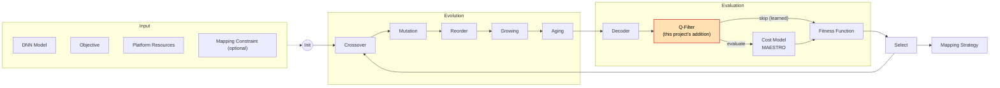
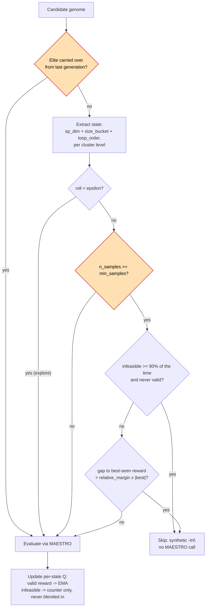

# Q-Learning-Gated Evaluation Filter for GA-Based DNN Accelerator Mapping

A genetic-algorithm search for DNN-accelerator hardware mappings, extended with a
Q-learning filter that learns to skip expensive cost-model evaluations for
genome families that are unlikely to be good — and a writeup of a real
regression I introduced, root-caused, and fixed.

This repo builds on **[GAMMA](https://dl.acm.org/doi/10.1145/3400302.3415639)**
(Kao & Krishna, ICCAD 2020, Georgia Tech), which uses a genetic algorithm to
search the space of ways a DNN layer can be mapped onto an accelerator
(loop order, tile sizes, spatial parallelism), scoring each candidate by
calling out to **[MAESTRO](http://maestro.ece.gatech.edu/)**, an external
cost-model binary that simulates the dataflow and reports latency/energy/area/power.
See [Credits](#credits--citation) below — the base GA, genome encoding, and
MAESTRO integration are the original authors' work; my contribution is the
Q-learning evaluation filter described here.



*Base pipeline (Input → Evolution → Evaluation → Select → Output) is the
original GAMMA design. The Q-Filter box is this project's addition, sitting
between the decoder and the expensive MAESTRO call. Original static diagram,
for reference: [`gamma.jpg`](./gamma.jpg).*

## TL;DR

- **The bottleneck**: every candidate genome in every generation costs one
  MAESTRO subprocess call. For a 20-generation, 20-population search that's
  ~400+ calls per layer.
- **My addition**: a `QFilter` that sits between genome decoding and the
  MAESTRO call, and learns (via a Q-table keyed on a coarse genome "state")
  which genome families are worth spending a MAESTRO call on at all.
- **What actually happened**: my first version made search results
  **37–70% worse** on resnet18 — the filter was silently breaking the GA's
  elitism guarantee. I root-caused it to four specific bugs, fixed them, and
  re-validated with seeded A/B runs across multiple models.
- **Where it landed**: across 30 seeded A/B trials (6 unique CNN layer
  configurations spanning 12 named backbones × 5 seeds), the fixed filter
  matched or beat the no-filter baseline in **21/30 (70%)**, while
  consistently skipping **~10% of MAESTRO calls** on every configuration (see
  [Results](#results) for the full table and honest caveats).

## The bug story (the part worth telling in an interview)

The first version of the filter tracked a single Q-value per genome "state"
(spatial dimension + loop order) using an epsilon-greedy skip rule. It looked
reasonable in isolation, but four separate issues compounded into a filter
that made the search *worse*, not faster-and-equal:

1. **Elites weren't protected.** Each generation's population is
   `elite + offspring`. The filter's skip mask was applied to *everyone*,
   including elites carried over from the previous generation. A skipped
   elite got a synthetic `-Inf` fitness, which corrupts the population's
   fitness array and can demote the true best-known genome out of the parent
   pool for crossover — breaking the invariant that elitism exists to
   guarantee (best-known fitness never regresses generation to generation).
   This was the dominant cause of the regression.
2. **One bad sample could gate a genome family permanently.** The original
   `should_evaluate` had no minimum-sample floor — a single infeasible
   result could tip a state below the skip threshold immediately.
3. **Infeasible results were blended into the same reward average as real
   scores.** Rejected genomes were folded in as a `-1e6` sentinel into the
   same exponential moving average as genuine MAESTRO rewards. States near
   the feasibility boundary — often exactly where the best mappings live —
   have many infeasible neighbors, so their average got dragged down and the
   filter pruned exactly the region the GA needed to keep exploring.
4. **The skip threshold was a hand-tuned absolute constant** calibrated by
   eyeballing one model's (resnet18) reward magnitudes. Latency/energy/area
   rewards differ by orders of magnitude across models and layers, so a
   fixed constant that works for one model can silently disable the filter
   (or over-prune) on another — which is what I'd originally noticed as
   "it doesn't work well for a few of the models."

Fix applied: elites are now always force-evaluated; infeasibility is tracked
as a separate per-state counter instead of polluting the reward signal; a
state needs `min_samples` observations before it can be skipped at all; and
the skip threshold is now relative to the best reward observed *in that run*
rather than a hardcoded number, so it self-calibrates per model/layer instead
of needing re-tuning. See [`src/GAMMA/q_filter.py`](src/GAMMA/q_filter.py).

## Results

Seeded A/B comparison (`--seed`, filter on vs. off), same generation/population
budget, before vs. after the fix:

**Before the fix** (original saved runs, resnet18, GEN-20/POP-20 and
GEN-50/POP-20): Q-filter was consistently **37–70% worse** than the
no-filter baseline.

**After the fix** — 12 named CNN backbones × 5 seeds each, single layer,
GEN-50/POP-50, `--seed` pinned per trial for a fair filter-on vs. filter-off
comparison (raw per-seed numbers:
[`benchmarks/qfilter_ab_results.csv`](benchmarks/qfilter_ab_results.csv) +
[`benchmarks/qfilter_ab_results_extended.csv`](benchmarks/qfilter_ab_results_extended.csv)).

**Important caveat about the "12 backbones" framing**: several of these
networks share an *identical* first-layer shape (many ResNet-family stems
are literally `64×3×224×224, 7×7`), so testing layer 1 of `resnet18`,
`resnet50`, `googlenet`, `wide_resnet50`, and `resnext50_32x4d` is the
*same search problem* run 5 times under different names — not 5
independent data points. Deduplicating by actual layer shape, there are
**6 genuinely distinct configurations** across the 12 named models. The
table below reports results per unique configuration, not per model name,
so the numbers aren't artificially inflated by counting duplicates as
independent evidence:

| Configuration (models sharing it) | Q-filter ≥ baseline | Median latency, no filter | Median latency, Q-filter | MAESTRO calls saved |
|---|---|---|---|---|
| resnet-stem (resnet18, resnet50, googlenet, wide_resnet50, resnext50_32x4d) | 3/5 | 149 | 103 | 10.7% |
| vgg16 | 4/5 | 51,067 | 50,161 | 10.0% |
| mobilenet-stem (mobilenet_v2, mnasnet) | 4/5 | 26,797 | 333 | 9.7% |
| squeezenet-stem (squeezenet, densenet) | 4/5 | 149 | 54 | 10.4% |
| alexnet | 2/5 | 343 | 366 | 11.2% |
| shufflenet_v2 | 4/5 | 169 | 38 | 9.7% |
| **Overall (30 unique trials)** | **21/30 (70%)** | — | — | **~10.3%** |

Caveats, stated plainly:
- These are single-layer searches at GEN-50/POP-50 — small enough that
  run-to-run variance from the GA's own randomness is real. Individual
  seeds show 10-80x swings in either direction (e.g. mobilenet-stem
  seed 2: 26,797 → 333), which is why the headline number is a **win rate**
  (matched-or-beat baseline in 21/30 unique trials) rather than an average —
  an arithmetic or geometric mean here would be dominated by a few outlier
  seeds and overstate precision the data doesn't support.
- Two configurations are clear weak points: resnet-stem (3/5) and, newly
  found in this expanded pass, **alexnet (2/5)** — its large 11×11 first-layer
  kernel is a distinct enough shape from the others that it's plausibly a
  real edge case, not noise. Not a fully solved problem; worth digging into
  further (see [Limitations](#limitations--future-work)).
- The fix trades away most of the *aggressive* skipping the original
  (broken) version did. MAESTRO-call savings are a consistent **~10%**
  across every configuration now — modest, but that consistency (vs. the
  wildly model-dependent behavior of the old hardcoded threshold) is itself
  the point. Recovering bigger compute savings would need more validation
  data before trusting a larger `relative_margin`.

## Limitations & Future Work

- **Two configurations are still weak spots: resnet-stem (3/5) and alexnet
  (2/5).** Worth profiling why specifically; a plausible hypothesis is that
  these particular layer shapes produce a different feasibility landscape
  than the other four configurations, but that's a hypothesis, not
  something I've verified yet.
- **"12 named backbones" is 6 unique layer configurations.** Several
  ResNet-family networks share an identical first-layer shape, so testing
  layer 1 of each isn't 12 independent data points — see the caveat in
  [Results](#results). A true 12-architecture validation would need to test
  a later, differentiating layer for each network, not just layer 1.
- **Only tested on CONV-style CNN backbones.** Transformer/GEMM-style layers
  (BERT, T5, ALBERT — all in `data/model/`) reshape the genome differently
  (`SzM, SzN, SzK` instead of `K, C, Y, X, R, S`) and weren't part of this
  validation pass. The state representation should generalize since it
  operates on the mapping structure rather than tensor semantics, but that's
  untested, not proven.
- **Single-layer, not full-network runs.** A real deployment would run this
  across every layer of a network; per-layer variance could partially
  average out, or compound, over a full model — untested here.
- **Compute savings are modest by design.** ~10% MAESTRO-call reduction is
  the safe end of the trade-off space; a more aggressive `relative_margin`
  or lower `min_samples` could save more, at the risk of reintroducing the
  original regression without more validation data to back it.

## How it works

The genome format, GA operators (crossover/mutation/reorder/aging), and
MAESTRO integration are the original GAMMA design — see
[`src/GAMMA/README.md`](src/GAMMA/README.md) for the full usage guide
(fitness objectives, constrained mapping spaces, PE-mapping co-exploration).

The Q-filter (`--use_qfilter`) is invoked once per candidate genome inside
`GAMMA.evaluate()`, right before the MAESTRO subprocess call. This is also,
concretely, a diagram of the fix — the elite bypass, the `min_samples` floor,
and the relative (not hardcoded) threshold are the four bugs from
[above](#the-bug-story-the-part-worth-telling-in-an-interview), fixed:



*(The orange nodes are the two gates that didn't exist in the original,
broken version — elite protection and the minimum-sample floor.)*

- **State**: for each cluster level in the genome, `(spatial_dim,
  size_bucket, loop_order)` — captures parallelization choice and reuse
  ordering per level without aliasing across cluster levels, while still
  generalizing over exact tile sizes (the GA's main mutation target).
- **Decision**: epsilon-greedy — explore with probability epsilon (decayed
  per generation, floored at `epsilon_min`), otherwise consult the Q-table:
  skip only if the state has enough samples, is either near-always
  infeasible or worse than the best reward seen this run by more than
  `relative_margin`.
- **Update**: valid MAESTRO results update a per-state EMA; infeasible
  results only increment a separate counter.

## Running it

MAESTRO's source is vendored under [`maestro/`](./maestro) (verified to build
clean with SCons + a C++17 toolchain + Boost — no external clone needed).
`build.py` builds it and symlinks the binary into `cost_model/maestro`,
where GAMMA expects to find it.

```
conda create --name gammaEnv python=3.6
conda activate gammaEnv
pip install -r requirements.txt
python build.py
ulimit -n 4096
./run_gamma.sh
```

Enable the filter and/or pin a seed for reproducible comparisons:
```
python main.py --model resnet18 --num_layer 1 --epochs 50 --num_pop 50 \
  --use_qfilter --seed 42
```

## Credits & Citation

The base GA, genome/mapping representation, and cost-model integration are
from the original GAMMA project and its extensions:

* Contributors: Sheng-Chun (Felix) Kao, Tushar Krishna
* [GAMMA](https://dl.acm.org/doi/10.1145/3400302.3415639) (ICCAD 2020)
* [DiGamma](https://arxiv.org/pdf/2201.11220.pdf) (DATE 2022)
* [Formalism of Accelerator Flexibility](https://dl.acm.org/doi/10.1145/3530907) (SIGMETRICS/PERFORMANCE 2022)

The vendored cost model under [`maestro/`](./maestro) is
[MAESTRO](https://github.com/maestro-project/maestro), MIT-licensed, from the
Synergy Lab at Georgia Tech — included here unmodified so the repo builds
standalone; see [`maestro/LICENSE`](./maestro/LICENSE).

```
@inproceedings{gamma,
    author       = {Kao, Sheng-Chun and Krishna, Tushar},
    title        = {GAMMA: Automating the HW Mapping of DNN Models on Accelerators via Genetic Algorithm},
    booktitle    = {ICCAD},
    year         = {2020}
}
```

Sister repo: [Gamma-Timeloop](https://github.com/maestro-project/gamma-timeloop)
(GAMMA on NVIDIA's Timeloop cost model instead of MAESTRO).
